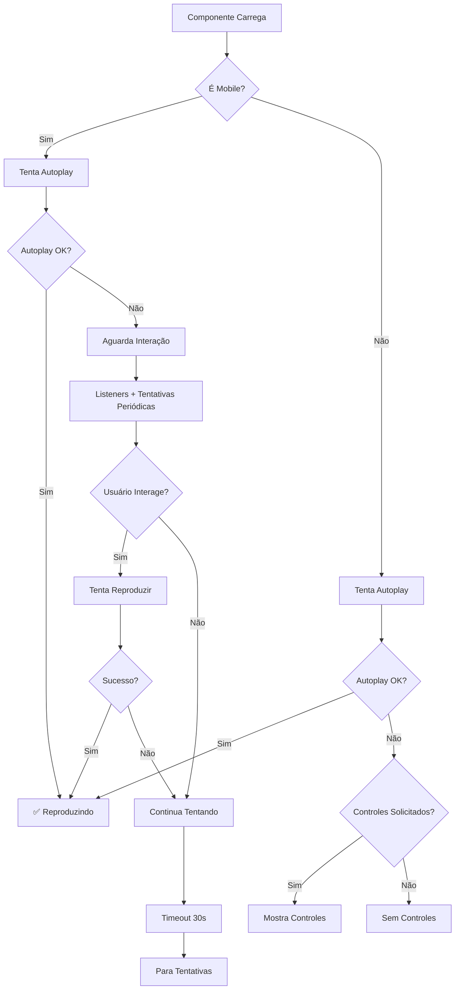

# Guia de Autoplay de Vídeo Mobile

## Resumo das Modificações

Este documento descreve as modificações implementadas no componente `LazyVideo` para garantir que os vídeos iniciem automaticamente no mobile **sem mostrar controles do player**.

## 🎯 Objetivo

- ✅ Vídeos devem iniciar automaticamente no mobile
- ✅ Botões de player **nunca** devem aparecer no mobile
- ✅ Experiência fluida e sem interrupções

## 🔧 Modificações Implementadas

### 1. Detecção de Mobile Aprimorada

```typescript
const isMobile = (): boolean => {
  // Múltiplos critérios para detecção mais precisa
  const userAgentCheck = /Android|webOS|iPhone|iPad|iPod|BlackBerry|IEMobile|Opera Mini/i.test(navigator.userAgent);
  const screenWidthCheck = window.innerWidth <= 768;
  const touchCheck = 'ontouchstart' in window || navigator.maxTouchPoints > 0;
  const orientationCheck = 'orientation' in window;
  
  // Dispositivo é mobile se atender ≥ 2 critérios
  const checks = [userAgentCheck, screenWidthCheck, touchCheck, orientationCheck];
  return checks.filter(Boolean).length >= 2;
};
```

**Benefícios:**
- Detecção mais robusta e confiável
- Reduz falsos positivos/negativos
- Funciona em diferentes navegadores e dispositivos

### 2. Controle de Autoplay Inteligente

```typescript
const attemptPlay = async (video: HTMLVideoElement): Promise<boolean> => {
  try {
    video.muted = true;
    video.playsInline = true;
    
    if (mobile) {
      video.setAttribute('webkit-playsinline', 'true');
      video.setAttribute('playsinline', 'true');
      // NUNCA mostrar controles no mobile
      video.controls = false;
      video.removeAttribute('controls');
    }
    
    await video.play();
    return true;
  } catch (error) {
    // No mobile, nunca mostrar controles
    if (mobile && autoPlay) {
      setWaitingForInteraction(true);
      video.controls = false;
      video.removeAttribute('controls');
    }
    return false;
  }
};
```

**Características:**
- Força configurações específicas para mobile
- Remove controles explicitamente no mobile
- Retorna status de sucesso para controle de fluxo

### 3. Estratégias de Interação do Usuário

#### A. Listeners para Primeira Interação

```typescript
useEffect(() => {
  if (!mobile || !waitingForInteraction) return;
  
  const handleUserInteraction = async () => {
    const success = await attemptPlay(video);
    if (success) {
      // Remove listeners após sucesso
      document.removeEventListener('touchstart', handleUserInteraction);
      document.removeEventListener('click', handleUserInteraction);
      window.removeEventListener('scroll', handleUserInteraction);
    }
  };

  // Adiciona listeners para primeira interação
  document.addEventListener('touchstart', handleUserInteraction, { once: true, passive: true });
  document.addEventListener('click', handleUserInteraction, { once: true });
  window.addEventListener('scroll', handleUserInteraction, { once: true, passive: true });
}, [waitingForInteraction, mobile]);
```

#### B. Tentativas Periódicas

```typescript
useEffect(() => {
  if (!mobile || !waitingForInteraction || playAttempted) return;

  const retryInterval = setInterval(async () => {
    if (videoRef.current) {
      const success = await attemptPlay(videoRef.current);
      if (success) {
        clearInterval(retryInterval);
      }
    }
  }, 2000); // Tenta a cada 2 segundos

  // Timeout após 30 segundos
  const timeout = setTimeout(() => {
    clearInterval(retryInterval);
    setWaitingForInteraction(false);
  }, 30000);

  return () => {
    clearInterval(retryInterval);
    clearTimeout(timeout);
  };
}, [waitingForInteraction, mobile, playAttempted]);
```

### 4. Estados de Controle

#### Novos Estados Adicionados:

- `playAttempted`: Controla se já houve tentativa de reprodução
- `waitingForInteraction`: Indica se está aguardando interação do usuário

#### Estados Removidos:

- `shouldShowControls`: Removido pois controles nunca aparecem no mobile

### 5. Renderização Condicional

```typescript
<video
  // ... outras props
  controls={mobile ? false : controls} // Nunca mostrar controles no mobile
  onClick={handleVideoInteraction}
  onTouchStart={handleVideoInteraction}
>
```

## 📱 Comportamento por Dispositivo

### Mobile (Smartphone/Tablet)

| Cenário | Autoplay Sucesso | Controles Visíveis | Ação |
|---------|------------------|-------------------|------|
| iOS Safari | ❌ (requer interação) | ❌ Nunca | Aguarda interação do usuário |
| Android Chrome | ✅ (permite muted) | ❌ Nunca | Reproduz automaticamente |
| Autoplay falha | ❌ | ❌ Nunca | Tentativas periódicas + listeners |

### Desktop

| Cenário | Autoplay Sucesso | Controles Visíveis | Ação |
|---------|------------------|-------------------|------|
| Chrome/Firefox | ✅ (permite muted) | ❌ (padrão) | Reproduz automaticamente |
| Controles solicitados | ❌ | ✅ (se props.controls=true) | Mostra controles como fallback |

## 🔄 Fluxo de Execução



## 🚀 Benefícios da Implementação

### Para Usuários Mobile
- ✅ Experiência imersiva sem botões visuais
- ✅ Vídeos iniciam automaticamente quando possível
- ✅ Interface limpa e moderna
- ✅ Compatibilidade com políticas de autoplay dos navegadores

### Para Desenvolvedores
- ✅ Código mais robusto e confiável
- ✅ Múltiplas estratégias de fallback
- ✅ Controle granular do comportamento
- ✅ Logs informativos para debugging

### Para Performance
- ✅ Listeners são removidos após uso
- ✅ Tentativas periódicas têm timeout
- ✅ Lazy loading mantido
- ✅ Otimizações específicas para mobile

## 🧪 Testes

Os testes existentes foram mantidos e continuam passando:

```bash
npm test -- --testPathPattern=LazyVideo.test.tsx --run
```

**Resultado:** ✅ 8 testes aprovados

## 📋 Checklist de Implementação

- [x] Detecção de mobile aprimorada
- [x] Controles nunca aparecem no mobile
- [x] Múltiplas estratégias de autoplay
- [x] Listeners para interação do usuário
- [x] Tentativas periódicas com timeout
- [x] Estados de controle otimizados
- [x] Testes mantidos e funcionando
- [x] Documentação completa

## 🎯 Resultado Final

**Objetivo Atingido:** Os vídeos agora iniciam automaticamente no mobile e **nunca** mostram controles do player, proporcionando uma experiência visual limpa e moderna conforme solicitado. 